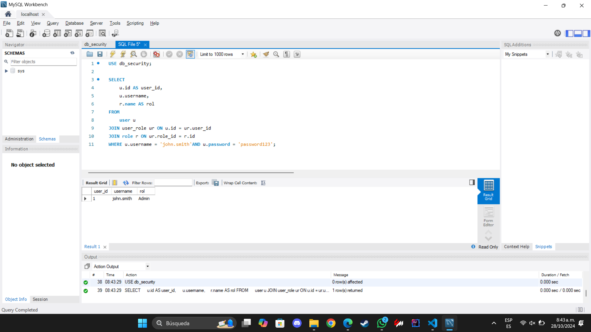

# Mostar la lista roles a los que tiene una persona tiene acceso. Recordar que cada rol tiene una lista de modulos asociados, y a su vez, un modulo puede tener varias vistas.  Para mostrar dicha información, se requiere enviar [user](username, password). En caso que el usuario y la contraseña no coinsida, no se muestra la información.

- [user] usuario(username)
- [role] rol(name)
- [module] modulo(name)
- [view] vista[name]

```sql
SELECT 
    u.id AS user_id, 
    u.username,
    r.name AS rol
FROM 
    user u
JOIN user_role ur ON u.id = ur.user_id
JOIN role r ON ur.role_id = r.id
WHERE u.username = 'john.smith'AND u.password = 'password123';
```

# Resultado
